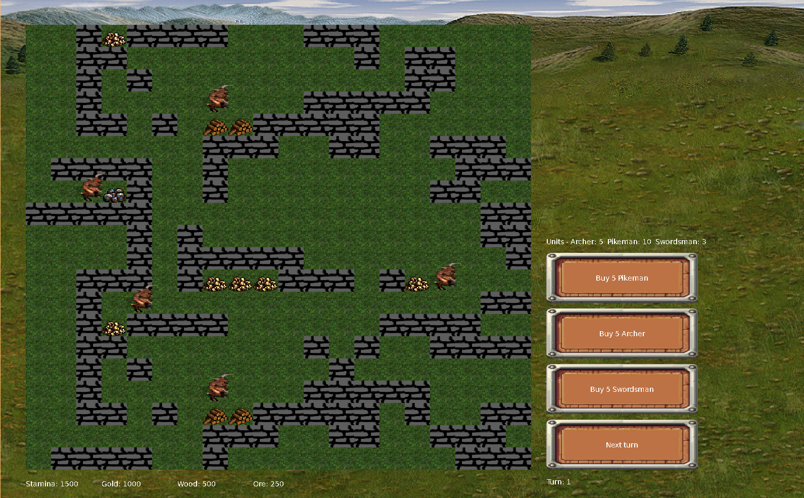

# HMM3 at home
Son: Mom can we buy hmm3? \
Mom: No, we have hmm3 at home. \
HMM3 at home: 



# Dependencies:
Required on a system:\
SDL2\
SDL2_image\
SDL2_TTF\
ImGui - included with git submodule
# Install dependencies
1.Clone repository with submodules:\
`git clone --recurse-submodules https://github.com/janBorowy/HMM3-clone`

2.Install SDL2 for your linux distribution, for example on archlinux:\
`sudo pacman -S sdl2`

# Ubuntu example
```bash
git clone https://github.com/janBorowy/HMM3-at-home --recurse-submodules
cd HMM3-at-home
mkdir build
cmake . -B build
cd build
cmake --build .
```

# Run
```bash
cd build
./HMM3-at-home # game
./test # doctest tests
```

# Controls
- click to select/move/attack
- move the map with WSAD/arrow keys

# Buttons
- Use buy buttons to buy soldiers
- 5 pikeman = 100 gold
- 5 archer = 100 wood
- 5 swordsman = 100 ore
- Use next turn button to refresh stamina and advance turn counter

# Map creation
Maps should have fixed width and height of 50 tiles.
